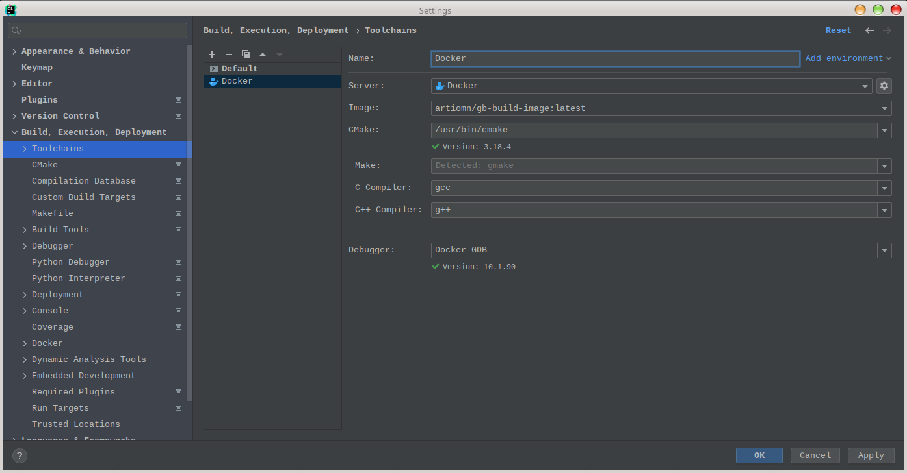
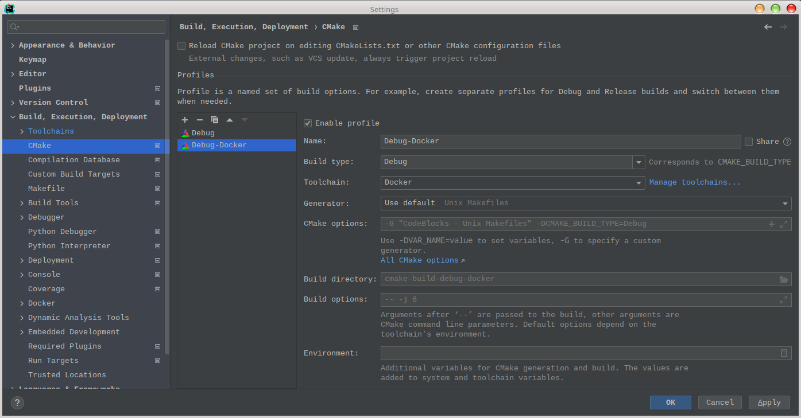
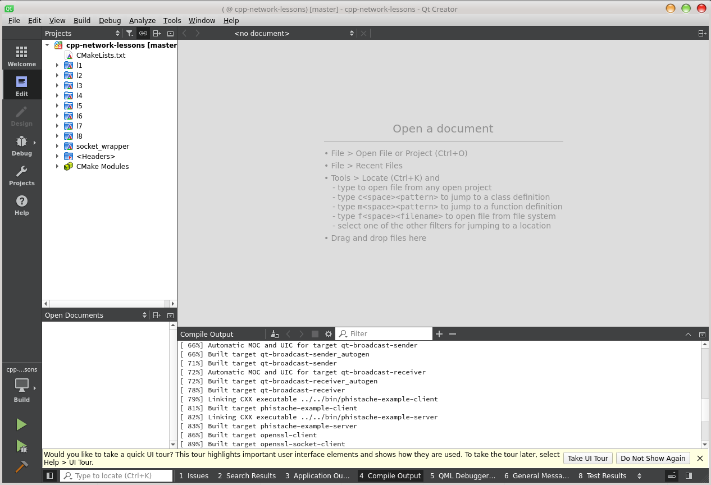

# Repository with a code for the  students

Это репозиторий, содержащий код для студентов, проходящих курс ["Сетевое программирование на C++" в GeekBrains](https://gb.ru/geek_university/cpp-developer).

- [Начало работы](#начало-работы)
- [FAQ](#faq)
  * [Как сделать домашнее задание, чтобы преподаватель его посмотрел?](#как-сделать-домашнее-задание-чтобы-преподаватель-его-посмотрел)
  * [Я художник, я так вижу, мне плевать на правила оформления.](#я-художник-я-так-вижу-мне-плевать-на-правила-оформления)
  * [Надо ли обновляться и как?](#надо-ли-обновляться-и-как)
  * [Где все примеры?](#где-все-примеры)
  * [Как собрать примеры?](#как-собрать-примеры)
  * [Сборка не проходит, вообще не собирается ничего.](#сборка-не-проходит-вообще-не-собирается-ничего)
  * [Почему используется Linux?](#почему-используется-linux)
  * [Могу ли я собрать код на Windows?](#могу-ли-я-собрать-код-на-windows)
  * [А есть что-то про CMake?](#а-есть-что-то-про-cmake)
  * [Docker - что это?](#docker---что-это)
    - [Как использовать Docker?](#как-использовать-docker)
    - [У меня сборка только под суперпользователем (root) запускается, почему?](#у-меня-сборка-только-под-суперпользователем-root-запускается-почему)
    - [Могу ли я собирать в IDE?](#могу-ли-я-собирать-в-ide)
    - [Не могу подключиться к Docker либо IDE его не видит, что делать?](#не-могу-подключиться-к-docker-либо-ide-его-не-видит-что-делать)
    - [В образе чего-то не хватает.](#в-образе-чего-то-не-хватает)
    - [Работая в Docker я не могу испортить систему?](#работая-в-docker-я-не-могу-испортить-систему)
  * [Как запустить собранное?](#как-запустить-собранное)
  * [Как запустить консоль?](#как-запустить-консоль)
  * [Где взять Netcat под Windows?](#где-взять-netcat-под-windows)
  * [Всё делаю правильно, но что-то не подключается.](#всё-делаю-правильно-но-что-то-не-подключается)
  * [Я нашёл ошибку в коде, могу ли я её исправить?](#я-нашёл-ошибку-в-коде-могу-ли-я-её-исправить)
  * [А у меня вопрос!](#а-у-меня-вопрос)


## Начало работы

Чтобы начать работать:

- Если [Docker](https://www.docker.com/) не установлен в системе, [установите его](#как-использовать-docker).
- Если [Git](https://git-scm.com/) не установлен в системе, [установите его](https://git-scm.com/book/ru/v2/Введение-Установка-Git).
- Склонируйте репозиторий: `git clone https://github.com/artiomn/cpp-network-tasks.git`.  
  **Внимание: склонируйте репозиторий в каталог, содержащий только латинские символы в пути!**
- Зайдите в каталог `cpp-network-tasks`.
- Запустите скрипт `./build_dockerized.sh`

Если это первый запуск, пройдёт значительное время перед тем, как вы получите результат.  
Возможно, что вам потребуется [установить Docker](#docker---что-это).

Для запуска IDE QtCreator выполните из каталога `cpp-network-tasks` следующую команду: `./run -q`.  
Будет запущена IDE, в которой необходимо открыть, как проект, файл `CMakeLists.txt` в каталоге `/home/developer/src` или `/usr/src/gb/src` (первый каталог - ссылка).


## FAQ

### Как сделать домашнее задание, чтобы преподаватель его посмотрел?

Чтобы ваше задание не получило статус **"Не сдано"** автоматически, ещё до проверки его преподавателем, выполните несколько правил:

- Проверьте, что код скомпилируется.
- Для сборки используйте [CMake](https://cmake.org/).
- Оформите код согласно кодовому стилю.

Подходящий вариант стиля для [ClangFormat](https://clang.llvm.org/docs/ClangFormat.html) находится в репозитории: [code-style.clang-format](code-style.clang-format).

\* Файл стиля был предоставлен Henryk ll Selenya.

Пример оформления вы увидите [в примерах к уроку](src/l1).

Кратко:

- В качестве отступов используются пробелы.
- Ширина отступа **4 пробела**.
- Открывающая фигурная скобка на следующей строки после имени.
- После `if`, `for` и подобных операторов - один пробел до скобки.
- После имён функций и методов нет пробелов.
- После открывающей и перед закрывающей круглыми скобками нет пробелов.
- После каждой запятой и точки с запятой - пробел.
- Названия классов пишутся в `CamelCase`.
- Названия функций, методов и переменных - в `snake_case`.
- Между реализациями функция и методов ставится две пустые строки.
- Внутри тела функций и методов **не допускается** более одной пустой строки.
- Атрибуты классов оканчиваются на `_`.
- Комментарии желательно оставлять на английском языке.
  В примерах они, местами, на русском. Исключительно потому, что примеры учебные.

Правильный вариант оформления:

```cpp
int main()
{
    std::cout
        << "Getting name for \"" << host_name << "\"...\n"
        << "Using getaddrinfo() function." << std::endl;

    addrinfo hints =
    {
        .ai_flags= AI_CANONNAME,
        // Неважно, IPv4 или IPv6.
        .ai_family = AF_UNSPEC,
        // TCP stream-sockets.
        .ai_socktype = SOCK_STREAM,
        // Any protocol.
        .ai_protocol = 0
    };

    // Results.
    addrinfo *servinfo = nullptr;
    int status = 0;

    if ((status = getaddrinfo(host_name.c_str(), nullptr, &hints, &servinfo)) != 0)
    {
        std::cerr << "getaddrinfo error: " << gai_strerror(status) << std::endl;
        return EXIT_FAILURE;
    }

    for (auto const *s = servinfo; s != nullptr; s = s->ai_next)
    {
        std::cout << "Canonical name: ";
        if (s->ai_canonname)
             std::cout << s->ai_canonname;
        std::cout << "\n";

        assert(s->ai_family == s->ai_addr->sa_family);
        std::cout << "Address type: ";

        if (AF_INET == s->ai_family)
        {
            char ip[INET_ADDRSTRLEN];
            std::cout << "AF_INET\n";
            sockaddr_in const * const sin = reinterpret_cast<const sockaddr_in* const>(s->ai_addr);
            std::cout << "Address length: " << sizeof(sin->sin_addr) << "\n";
            in_addr addr = { .s_addr = *reinterpret_cast<const in_addr_t*>(&sin->sin_addr) };

            std::cout << "IP Address: " << inet_ntop(AF_INET, &addr, ip, INET_ADDRSTRLEN) << "\n";
        }
        else if (AF_INET6 == s->ai_family)
        {
            char ip6[INET6_ADDRSTRLEN];

            std::cout << "AF_INET6\n";
        }
        else
        {
            std::cout << s->ai_family << "\n";
        }
        std::cout << std::endl;
    }
    std::cout << std::endl;

    freeaddrinfo(servinfo);

    return EXIT_SUCCESS;
}
```

[К оглавлению ⮐](#repository-with-a-code-for-the--students)


### Я художник, я так вижу, мне плевать на правила оформления

Ваша работа сразу автоматически отправляется в помойку.

[К оглавлению ⮐](#repository-with-a-code-for-the--students)


### Надо ли обновляться и как?

Иногда - надо. Когда в код или образ вносятся изменения, о чём вам должны сообщить.
Если вы работаете с Git репозиторием, код обновляется следующим образом:

```
git pull 
```

Если вам предоставляется архив, преподаватель обновит его сам.

Docker образы могут быть обновлены следующими командами:

```
artiomn/gb-build-image
artiomn/gb-qt-creator-image
```

[К оглавлению ⮐](#repository-with-a-code-for-the--students)


### Где все примеры?

Те, что сделаны, - в надёжном месте. Они будут добавляться по мере прохождения уроков.
Доступные вам примеры находятся в каталоге `src/l<номер_урока>`.

[К оглавлению ⮐](#repository-with-a-code-for-the--students)


### Как собрать примеры?

Сборка производится, используя CMake, поэтому:

- Вы можете использовать любую современную IDE для сборки.
- Скрипт `./build.sh`.
- Прямой запуск CMake.

Проблемой является то, что сборка не подгружает зависимости.
Поэтому, для того, чтобы собрать без необходимости заниматься установкой множества пакетов, используется подготовленная среда.
Она представляет собой Docker-контейнер, образ которого [лежит на docker.hub](https://hub.docker.com/r/artiomn/gb-build-image).
Сборка в ней запускается через скрипт `./build_dockerized.sh`.

Под Windows сборка была проверена на MSVS 2019 и собранные артефакты будут находиться в `src\out\build\windows-default\bin`.
Собираться под Windows будет не всё, есть примеры только под Linux.

[К оглавлению ⮐](#repository-with-a-code-for-the--students)


### Сборка не проходит, вообще не собирается ничего

Может быть несколько причин из-за которых не проходит сборка.
Для начала, убедитесь, что у вас:

- Правильно [настроен и работает Docker](#как-использовать-docker).
- Если это первая сборка, есть доступ в Интернет.

Далее, проверьте, что каталог в котором производится сборка, не содержит в пути не латинских символов, пробелов и спецсимволов.

**Не делайте каталог вида**: `~/Общедоступные/user/geekbrains/lessons/C++-network/Programming_Lessons & Code/Репозиторий!/cpp-network-tasks`.  
Для **большинства сборок** - это верный путь к проблемам, о которых не знали разработчики.

Положите репозиторий в каталог с нормальным именем, например `~/projects/cpp-network-tasks`.

Если вы уже собирали проект локально и хотите собрать его в Docker или, наоборот, собирали в Docker и хотите собрать локально, CMake выдаст ошибку, похожую на следующую:

```
CMake Error: The current CMakeCache.txt directory /home/user/projects/cpp-network-tasks/build/CMakeCache.txt is different than the directory /usr/src/gb/build where CMakeCache.txt was created. This may result in binaries being created in the wrong place. If you are not sure, reedit the CMakeCache.txt
CMake Error: The source "/home/artiom/user/cpp-network-tasks/src/CMakeLists.txt" does not match the source "/usr/src/gb/src/CMakeLists.txt" used to generate cache.  Re-run cmake with a different source directory.
```

Что говорит о том, что конфигурации CMake различаются, вы запускаете его в разном окружении.

Чтобы исправить это, **удалите каталог `build`** и запустите сборку заново:

```
➭ rm -rf build && ./build_dockerized.sh
```

[К оглавлению ⮐](#repository-with-a-code-for-the--students)


### Почему используется Linux?

- Потому что, на Linux и BSD системах работают большинство сетевых приложений.
- На Linux работает автор курсов.
- Кроме Linux есть множество других ОС, и рассмотреть особенности каждой невозможно.
- Перевод кода на Windows оговорён.
- По возможности, код и так кроссплатформенный.

[К оглавлению ⮐](#repository-with-a-code-for-the--students)


### Могу ли я собрать код на Windows?

Да, возможно собрать часть кода. Сборка проверялась на MS Visual Studio 2019.  
Чтобы собрать код, надо открыть корневой CMakeLists.txt, как CMake проект.  

Но есть следующие проблемы:

- Есть код специфичный для Linux, например перехватчик вызовов, который будет собираться и работать только на этой платформе.
- Некоторый код просто не был адаптирован для Windows, и его сборка выключена.
- Есть редкие примеры, которые собираются, но работать корректно не будут (один из таких - асинхронный сервер на `select()`).
  Оно не работает, потому что не было достаточно времени и мотивации, чтобы доработать под Windows.
  Если вы считаете, что можете доделать такой код - You're welcome.
- В Windows есть не все библиотеки, а CMake не имеет, например модуля для поиска Qt, если Qt не установлен.
  Это приводит к тому, что пример не просто нельзя собрать, если чего-то не хватает, а падает сборка.
  Конечно, возможно это исправить, если вы считаете, что нужно, репозиторий открыт для правок.

Также, есть некоторый код, специфичный для Windows, но в уроках он, как правило, не упоминается.

[К оглавлению ⮐](#repository-with-a-code-for-the--students)


### А есть что-то про CMake?

Есть:

- [Вебинар GB](https://gbcdn.mrgcdn.ru/uploads/record/133973/attachment/dc6035ef4087e028dafb86507e6d1ebd.mp4), который вы должны были смотреть к началу курса.
- [Документация](https://cmake.org/documentation/).
- [Статьи](https://habr.com/ru/post/431428/).
- Много информации в Интернете.

[К оглавлению ⮐](#repository-with-a-code-for-the--students)


### Docker - что это?

Предполагается, что в процессе работы с курсом, вы будете активно использовать поиск.  
Соответственно, [Google поможет](https://google.gik-team.com/?q=Docker).  
Если очень кратко, [Docker](https://ru.wikipedia.org/wiki/Docker) - это один из вариантов реализации автоматизации инфраструктуры контейнеризации.  
Он позволяет изолировать приложения в контейнерах, образы которых скачаны из репозитория.
Здесь он нужен для того, чтобы:

- Вы могли собрать код, не устанавливая лишних библиотек.
- Вы могли проверить сборку тем же самым компилятором, что и проверяющий.

Напомню, что образ с инструкциями [лежит на Docker.hub](https://hub.docker.com/r/artiomn/gb-build-image).
У GeekBrains есть [поясняющее видео](https://gb.ru/events/3942) про C++ в Docker.

[К оглавлению ⮐](#repository-with-a-code-for-the--students)


#### Как использовать Docker?

На Windows только [вместе с Linux подсистемой](https://docs.microsoft.com/en-us/windows/wsl/install).  
На Linux его надо установить, а как, зависит от вашего дистрибутива.
Например, в deb-based это делается [по следующей инструкции](https://docs.docker.com/engine/install/debian/).

[К оглавлению ⮐](#repository-with-a-code-for-the--students)


#### У меня сборка только под суперпользователем (root) запускается, почему?

Управлять Docker, в том числе и запускать или останавливать контейнеры могут только:

- Пользователь `root`.
- Пользователи в группе `docker`.

Добавить вашего пользователя в группу Docker возможно по-разному. Один из вариантов, который будет работать для многих дистрибутивов:

```
$ sudo usermod -a -G docker "${USER}"
```

После этого надо завершить сессию, например выйти на Login Screen, и снова войти.

[К оглавлению ⮐](#repository-with-a-code-for-the--students)


#### Могу ли я собирать в IDE?

Это зависит от IDE. Возможно использовать удалённую сборку по SSH (сервер установлен в образе), некоторые IDE, такие как CLion, поддерживают работу с Docker напрямую.  

[К оглавлению ⮐](#repository-with-a-code-for-the--students)


##### CLion

Пример настройки CLion показан [здесь](https://blog.jetbrains.com/clion/2021/10/clion-2021-3-eap-new-docker-toolchain/).

Настройки конфигурации Docker показаны на скриншоте:



Настройки конфигурации CMake:



[К оглавлению ⮐](#repository-with-a-code-for-the--students)


##### QtCreator

Раньше QtCreator не поддерживал [удалённую сборку по SSH](https://stackoverflow.com/questions/42880004/with-qtcreator-how-can-i-build-my-project-on-a-remote-server-i-have-ssh-access).

Есть вариант настройки [с подмонтированием каталога через SSHFS](https://forum.qt.io/topic/9928/qt-creator-remote-development-via-ssh-for-desktop-projects).
Но все пути к инклудам, а также библиотекам, естественно, будут некорректны, т.к. в контейнере они другие.

Возможно самый просто вариант - установить QtCreator в контейнер и запустить оттуда.
На данный момент для этого [собран образ](https://hub.docker.com/r/artiomn/gb-qt-creator-image).
Чтобы запустить его, используйте:

```
./run -q
```



[К оглавлению ⮐](#repository-with-a-code-for-the--students)


#### Не могу подключиться к Docker либо IDE его не видит, что делать?

Проверьте:

- Установлен ли у вас Docker. Если нет - [установите](https://docs.docker.com/engine/install/).
- Достаточно ли прав у вашего пользователя, что с Docker взаимодействовать.

В большинстве дистрибутивов, при установке Docker создаёт группу `docker`, что вы можете проверить, выполнив следующую команду:

```
$ grep docker /etc/group
docker:x:997:
```

Видно, что пользователя в этой группе нет.
Добавьте его туда:

```
$ sudo usermod -a -G docker "$USER"
```

```
$ grep docker /etc/group
docker:x:997:artiom
```

После того, как вы перелогинитесь в системе, группа будет видна:

```
$ groups
sys network power video storage lp input audio wheel artiom docker
```

[К оглавлению ⮐](#repository-with-a-code-for-the--students)


#### В образе чего-то не хватает

Возможно, образ устарел.
Обновите его:

```
$ docker pull artiomn/gb-build-image
Using default tag: latest
latest: Pulling from artiomn/gb-build-image
Digest: sha256:be8e76c39543bd03f503a294d96dc578c5ad90b77c1473e6b03ef1feb88c0b0c
Status: Downloaded newer image for artiomn/gb-build-image:latest
docker.io/artiomn/gb-build-image:latest
```

[К оглавлению ⮐](#repository-with-a-code-for-the--students)


### Работая в Docker я не могу испортить систему?

Можете. Контейнер запускается в privileged режиме. Т.е. из него возможно создавать устройства, а значит испортить всё, что угодно.
Это требуется для того, чтобы сети, в частности Yggdrasil, могли создать TUN устройство.

[К оглавлению ⮐](#repository-with-a-code-for-the--students)


### Как запустить собранное?

Если вы производили сборку, как указано выше, собранные бинарные файлы будут находиться в каталоге `build/bin`.
Запустить вы их можете напрямую, однако из-за отсутствующих в системе зависимостей работать может не всё.
Поэтому, запуск также производится в контейнере, используя команду `./run`, которой передаются необходимые приложению аргументы и путь к нему.

Пример:

```
➭ ./run sudo ./build/bin/ping google.com
Pinging "google.com" [64.233.165.113]
Start to sending packets...
Sending packet 0 to "google.com" request with id = 29
Receiving packet 0 from "google.com" response with id = 29, time = 15.5ms
```

[К оглавлению ⮐](#repository-with-a-code-for-the--students)


### Как запустить консоль?

- `./run`
- `docker-compose run --rm gb` - для тех, кто пользуется docker-compose.

**Обратите внимание:** консоль запускается через **скрипт `./run`** в корне репозитория, **не** через `docker run`.


[К оглавлению ⮐](#repository-with-a-code-for-the--students)


### Где взять Netcat под Windows?

Например, [здесь](https://github.com/diegocr/netcat).

**Внимание!**  
Windows Defender может заблокировать Netcat, определив его, как Netcat.Hacktool.
В таком случае, просто отключите "защиту реального времени".

[К оглавлению ⮐](#repository-with-a-code-for-the--students)


### Всё делаю правильно, но что-то не подключается

Такая проблема была у одного из студентов. Он выяснил, что Netcat подключался на IPv6 адрес, тогда как сервер прослушивал только IPv4.
Как исправить? Зависит от приложения. Задайте ему не доменное имя, а IPv4 адрес явно, при возможности.
Для Netcat возможно использовать опцию `-4` (не все реализации её поддерживают).

[К оглавлению ⮐](#repository-with-a-code-for-the--students)


### Я нашёл ошибку в коде, могу ли я её исправить

Да. Следуя обычному процессу Guthub:

- Сначала делаете форк репозитория.
- Клонируете его, исправляете ошибку.
- Делаете Pull request.

Или просто можете просто завести [Issue](https://github.com/artiomn/cpp-network-tasks/issues/new/choose).
Но, в этом случае, обещать быстрое исправление я не могу.

[К оглавлению ⮐](#repository-with-a-code-for-the--students)


### А у меня вопрос!

Замечательно. Но прежде, чем задавать его преподавателю, вы пробовали найти ответ? Возможно, что его [надо лишь поискать](https://www.google.com)?
У преподавателя не так много времени для того, чтобы делать это за вас. Если ответа нет - задавайте.

[К оглавлению ⮐](#repository-with-a-code-for-the--students)
